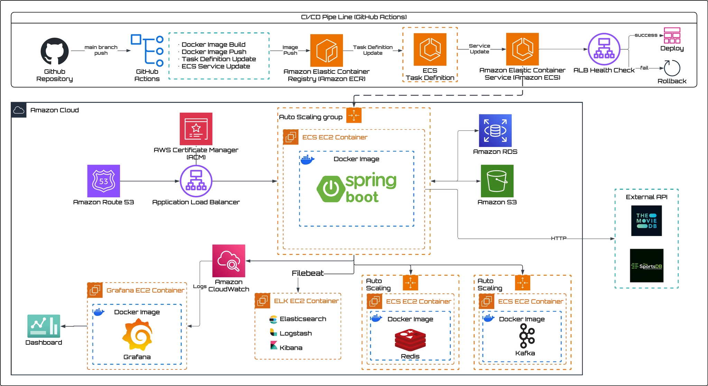

[](https://codecov.io/gh/sb10-team06/sb10-moduply-team6)


> 콘텐츠(영화/드라마/스포츠)를 평가하고 큐레이션하며, 실시간으로 같이 시청하고 채팅할 수 있는 플랫폼입니다.

---
## 📕 프로젝트 개요
- 프로젝트 기간: 2026.06.18 ~ 2026.07.29

- [📎 배포 링크](http://moduply.co.kr/)

- [📎 API Swagger](https://moduply.co.kr/swagger-ui/index.html)

- [📎 팀 협업 문서 (Notion)](https://app.notion.com/p/6-511fa6ca4c4482258b0c01401ed10b2e?source=copy_link)


## 👤 팀원 구성

| 이름  | GitHub                                     | 역할                 |
|-----|--------------------------------------------|--------------------|
| 곽인성 | [@kwaksss](https://github.com/kwaksss)     | 팀장, 프로필 관리, k6 부하테스트 |
| 김민형 | [@Minbro-Kim](https://github.com/Minbro-Kim) | 실시간 같이 보기, WebSocket |
| 김진우 | [@zinuzanu](https://github.com/zinuzanu) | 콘텐츠 관리, Spring Batch|
| 김현재 | [@hyunjae3458](https://github.com/hyunjae3458) |사용자 관리 기능, CI/CD 파이프라인 및 인프라 구축, 인증/인가 구현|
| 박 린 | [@boolynn17](https://github.com/boolynn17) | 콘텐츠 큐레이팅, 알림, SSE|

---

## 🛠️ 기술 스택

### Backend


### Database

-1B4F72?style=for-the-badge&logo=h2database&logoColor=white)

### 실시간 통신
-010101?style=for-the-badge&logo=websocket&logoColor=white)


### External API


### Infra


### CI/CD & Code Review


### Loading test

### Collaboration & Tools


---

## ⚙️ 배포 다이어그램


---
## 📁 디렉토리 구조

```text
src/main
├── java
│   └── com
│       └── team6
│           └── moduply
│               ├── Sb10ModuplyTeam6Application.java  # 애플리케이션 진입점
│               ├── auth                              # 인증/인가 (JWT, Spring Security)
│               ├── binarycontent                     # 이미지 파일 관리 (S3)
│               ├── common                            # 공통 설정 및 유틸리티
│               ├── content                           # 콘텐츠 도메인
│               ├── conversation                      # 대화방 도메인
│               ├── directmessage                     # 다이렉트 메시지
│               ├── follow                            # 팔로우/팔로워
│               ├── notification                      # 알림
│               ├── playlist                          # 플레이리스트
│               ├── review                            # 리뷰 및 평점
│               ├── sse                               # SSE 실시간 알림
│               ├── testdata                          # 테스트 데이터 생성
│               ├── user                              # 사용자 도메인
│               └── watching                          # 실시간 같이 보기
└── resources
    ├── application-data-gen.yml  # 테스트 데이터 생성 환경 설정
    ├── application-dev.yml       # 개발 환경 설정
    ├── application-local.yml     # 로컬 환경 설정
    ├── application-prod.yml      # 운영 환경 설정
    ├── application-test.yml      # 테스트 환경 설정
    ├── application.yml           # 공통 설정
    ├── logback-spring.xml        # 로그 설정
    ├── schema.sql                # DB 스키마
    └── static                    # 프론트엔드 정적 리소스

```

---

## 📌 팀원별 상세 구현 기능
### 곽인성
### 김진우
- **콘텐츠**: 콘텐츠 생성·조회·목록·수정·삭제 API와 콘텐츠 유형·태그·평점·리뷰 수 기반 필터링/정렬, QueryDSL 기반 동적 조회 및 커서 페이지네이션을 구현했습니다.
- **콘텐츠 조회 최적화**: 콘텐츠-태그 조회 과정의 N+1 문제를 일괄 조회 방식으로 개선하고, 리뷰 통계와 WatchingSession 기준 실시간 시청자 수를 조회 시점에 조합하도록 개선했습니다.
- **외부 API/배치**: TMDB와 The Sports DB 기반 콘텐츠 수집 구조를 구현하고, 외부 API 데이터를 내부 Content 모델로 변환하는 클라이언트·매핑 구조와 중복 저장 방지 로직을 구성했습니다.
- **콘텐츠 수집 배치**: TMDB와 Sports DB 수집 작업을 Spring Batch Job/Step으로 분리하고, 초기 수집·정기 수집, 수집 범위, 리그, 요청 간격을 설정값으로 관리하도록 구현했습니다.
- **Elasticsearch 검색**: 기존 DB LIKE 검색을 Elasticsearch Full Text Search 기반으로 전환하고, 콘텐츠 검색용 Document·Repository·Mapper와 생성/수정/삭제 시 색인 동기화 구조를 구현했습니다.
- **검색 품질/안정성**: 제목·태그·설명 필드 가중치, phrase/prefix 검색, _score 우선 정렬, search_after 커서 페이지네이션을 적용하고, ES 장애·인덱스 누락 시 QueryDSL fallback 및 자동 재색인 처리를 구현했습니다.
### 김민형
### 김현재
- **사용자 관리**: 회원가입, 이메일 중복 검증, 사용자 조회·수정, 비밀번호 재발급·변경, 관리자 권한 변경과 계정 잠금/해제를 구현했습니다.
- **인증/인가**: Spring Security 기반 로그인 성공·실패 처리, JWT 요청 필터, 로그아웃, Refresh Token 재발급, 인증·인가 실패 응답을 구성했습니다.
- **Redis 상태 관리**: Refresh Token 화이트리스트, Access Token 블랙리스트, 사용자별 tokenVersion, 로그인 세션 레지스트리와 브라우저별 활성 세션 인덱스를 설계했습니다.
- **OAuth2**: Google/Kakao 사용자 정보 파싱과 계정 동기화, 자체 JWT 발급, HttpOnly Refresh Token 쿠키 전달 흐름을 구현했습니다.
- **CI/CD**: GitHub Actions에서 테스트, Docker 이미지 빌드, ECR Push, ECS Task Definition 갱신과 실패 시 이전 버전 롤백을 자동화했습니다.
- **AWS 배포**: ALB·ACM·Route 53·RDS와 App·Redis·Kafka별 실행 환경을 구성하고 비용 제약에 맞춰 ECS EC2 Capacity Provider와 전용 EC2를 조합했습니다.
- **운영 관측성**: Grafana와 CloudWatch로 인프라 지표를 시각화했습니다

### 박 린
- **플레이리스트**: 플레이리스트 CRUD, 콘텐츠 추가/삭제, 구독/구독취소, 구독자 수 기준 정렬, Caffeine 캐싱 적용 및 N+1 쿼리 개선을 구현했습니다.
- **리뷰**: 리뷰 생성/수정/삭제/목록 조회, 복합 커서 페이지네이션(rating:createdAt), 작성자 프로필 이미지 URL 생성을 구현했습니다.
- **알림**: 플레이리스트 구독·콘텐츠 추가·팔로우·DM 수신·권한 변경 알림 발송, 커서 기반 알림 목록 조회, 읽음 처리를 구현했습니다.
- **SSE**: 실시간 알림 전송을 위한 SSE 연결 관리, Redis Pub/Sub 기반 다중 서버 브로드캐스트, Last-Event-ID 기반 유실 알림 재전송을 구현했습니다.
- **ELK**: Logstash 파이프라인 구성(grok 파싱, MDC 필드 추출), Filebeat 로그 수집 설정, Kibana 대시보드 구성(레벨별 로그 건수, 시간대별 추이, HTTP 메서드별 분포)을 담당했습니다.

