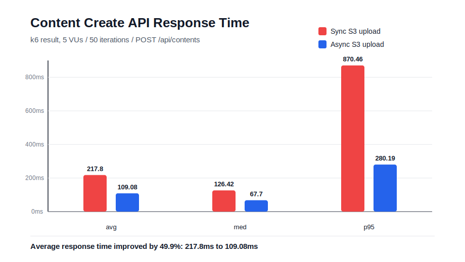

# S3 Upload Async Performance Comparison

## 문제

콘텐츠 생성 API는 썸네일 이미지를 함께 업로드한다. 동기 구조에서는 콘텐츠 DB 저장 이후 S3 업로드까지 요청 스레드가 기다려야 하므로, S3 같은 외부 I/O 지연이 API 응답 시간에 직접 반영된다.

## 해결 과정

S3 업로드를 `BinaryContentCreatedEvent` 기반 비동기 이벤트 리스너로 분리했다. 비동기 전 코드가 남아 있지 않아, `MODUPLY_BINARY_CONTENT_ASYNC_ENABLED` 설정으로 동기/비동기 모드를 전환해 같은 k6 스크립트로 비교했다.

- 동기 모드: `MODUPLY_BINARY_CONTENT_ASYNC_ENABLED=false`
- 비동기 모드: `MODUPLY_BINARY_CONTENT_ASYNC_ENABLED=true`
- 측정 도구: k6
- 조건: 5 VUs, 50 iterations, `POST /api/contents`



## 결과

| 모드 | avg | med | p95 | 성공률 |
|---|---:|---:|---:|---:|
| 동기 | 217.8ms | 126.42ms | 870.46ms | 100% |
| 비동기 | 109.08ms | 67.7ms | 280.19ms | 100% |

평균 응답 시간 개선율:

```text
(217.8 - 109.08) / 217.8 * 100 = 49.9%
```

콘텐츠 생성 과정에서 S3 업로드를 요청 스레드에서 직접 처리하지 않고 트랜잭션 커밋 이후 별도 스레드에서 처리하도록 변경한 결과, 평균 응답 시간이 `217.8ms`에서 `109.08ms`로 감소했다.
